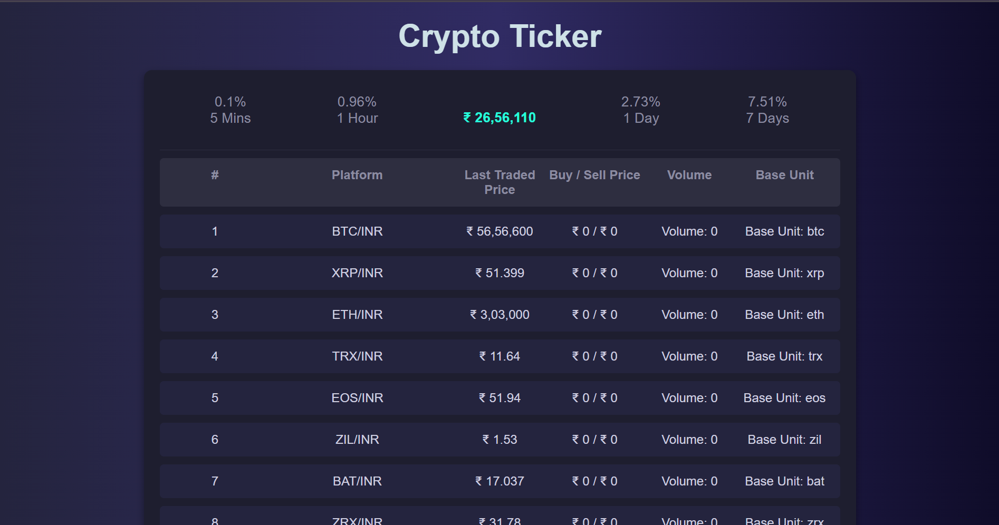

# 🚀 Crypto Ticker Dashboard

This project is a Crypto Ticker Dashboard that displays cryptocurrency prices, buy/sell prices, and volume, inspired by the HODLINFO layout. It utilizes a Node.js/Express backend to fetch and store data from the WazirX API, and a frontend built with HTML, CSS, and JavaScript to display the data in a visually appealing, responsive UI.

## ⚙️ Features

Backend: Uses axios to fetch data from the WazirX API and store it in a MongoDB database.

Frontend: Displays the fetched data in a UI similar to HODLINFO's layout, with a responsive design.

### 💻 Frontend Overview

### index.html 
The main HTML file displays the ticker dashboard and uses a container layout to display each cryptocurrency's information.

### main.js

 Fetches Data: Sends a GET request to the backend API to retrieve cryptocurrency data.

DOM Manipulation: Dynamically creates HTML elements for each cryptocurrency ticker item and displays them in the container.

### styles.css
Gradient Background: Provides a dark gradient background for the entire page.
Responsive Design: Adjusts layouts for desktop and mobile viewports.

Hover Effects: Adds subtle animations to each ticker row for better interactivity.

# 🔙 Backend Overview

### tickersController.js

Data Fetching: Uses axios to fetch cryptocurrency data from the WazirX API.

Data Processing: Formats and saves relevant data (name, last traded price, buy/sell prices, volume, and base unit) to MongoDB.

Data Retrieval: Returns the saved data in JSON format for frontend use.

connectDB.js : Establishes a connection to MongoDB, ensuring data persistence for the ticker data.

app.js : Express Server Setup: Configures Express server, connects to MongoDB, and sets up routes for data fetching and display.

Routing: Defines /api/tickers route for frontend to retrieve formatted ticker data.

## 🛠️ Dependencies

### Backend:

Express: Web framework for handling routes and middleware.

axios: Used to fetch data from the WazirX API.

mongodb: Database for storing fetched cryptocurrency data.

dotenv: For managing environment variables.

### Frontend:

HTML/CSS: Standard technologies for creating the dashboard UI.

JavaScript: For fetching data from the backend and dynamically updating the UI.

📷 Screenshots

